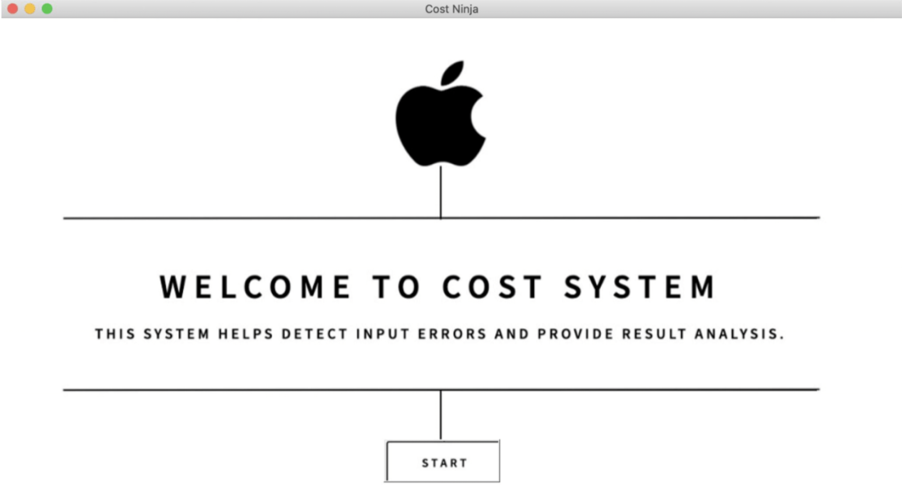
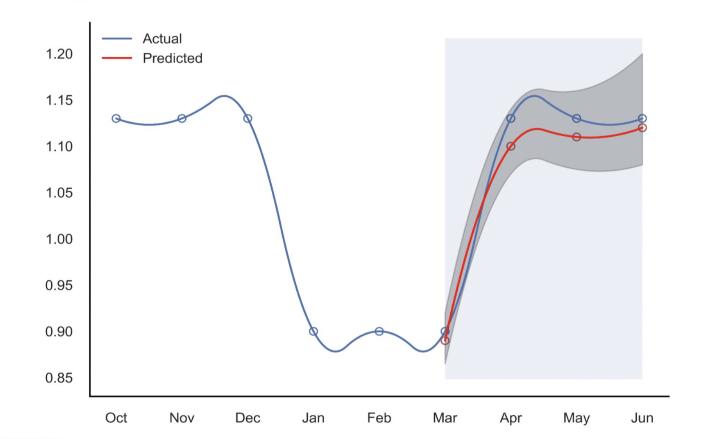

# Forecasting Apple's supply chain costs
## Built ARIMA time-series models with < 0.1% MAPE

I worked as a Student Data Scientist at Apple, in a team of 5 students from Columbia Engineering.
  This is the project that we worked on, which resulted in cost savings of $20 million yearly.
<li> Designed desktop application that uses ARIMA models to predict cost and detect errors.
<li> Created interactive Tableau dashboards depicting costs across components and time.
 
# About
Apple purchases components parts for its products from third party suppliers. The prices of these parts can be volatile at times due to trends and seasonalities, which snowballs into significant supply chain cost impacts.

This project uses ARIMA models to predict a reasonable cost range for hundreds of parts in each month. These models work in the back-end of the following desktop application:
 

The application takes in data on component part costs, in both Excel and CSV formats. Upon running the ARIMA models, it then flags out warnings for component parts whose costs are higher than they should be, and produces analysis reports explaining the likely reasons behind the cost spike.

This can be used in real-time to catch areas in which Apple may be overpaying in its supply chain, or used on an ex-ante basis to negotiate future part costs with suppliers.

# Data
Cost that Apple paid for each component part in each month. The data covers 768 component parts across multiple years.

# Project Methodology
1. Remove outliers in data to discard noise. Next, simulate data for component parts with lesser cost history data using a normal distribution with the same mean and variance as the available data.

2. Build one ARIMA model for each component part's cost. As such, 768 models are trained. For each model, grid search for its optimal ARIMA (p, d, q) hyperparameters, determined by the lowest MAPE on a left-out test set.

3. When predicting the cost of a component part for the next month, apart from simply outputting cost predictions, calculate a 95% confidence interval for the prediction. This serves as a reasonable cost range for the part. Below is a graphical illustration, where the cost range is shown as a shaded grey area

# Still curious?
Check out this project on my website <a href="_____">here</a> :)

